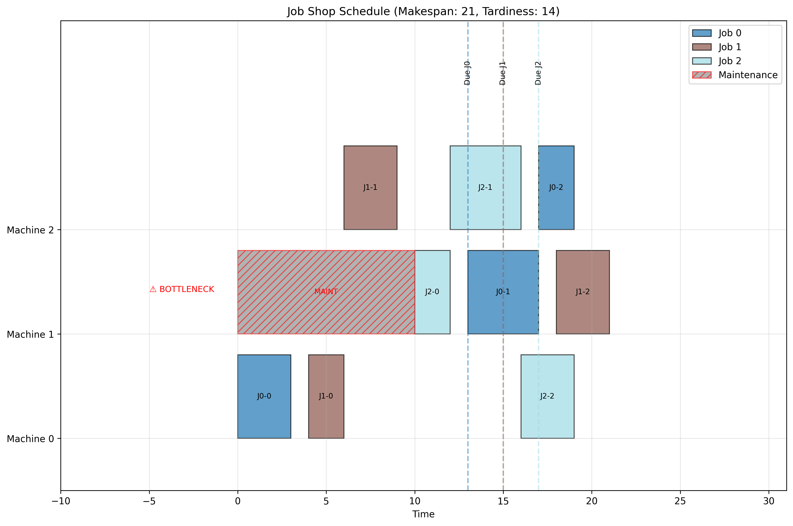

# Job Shop Scheduling Avancé avec IA

Ce projet implémente un système avancé de résolution pour le problème de Job Shop Scheduling (JSP) avec des contraintes supplémentaires (maintenance, ressources, temps de préparation, dates d'échéance), en utilisant la programmation par contraintes et l'intelligence artificielle.

## Caractéristiques

- Modélisation complète du problème JSP avec contraintes multiples
- Optimisation multi-objectif (makespan + tardiveté)
- Intégration d'OpenAI pour l'optimisation des paramètres
- Génération d'heuristiques intelligentes par IA
- Analyse et recommandations automatisées des solutions
- Visualisation avancée des plannings

## Structure du Projet

```
├── basic_jobshop.py           # Modèle de base pour le JSP
├── advanced_jobshop.py        # Modèle avec contraintes supplémentaires
├── advanced_jobshop_ai.py     # Intégration de l'IA pour les paramètres
├── advanced_jobshop_ai_heuristic.py  # Version avec heuristiques par IA
├── ai_enhancer.py             # Fonctions d'amélioration par IA
├── heuristics.py              # Implémentation des heuristiques
├── visualization.py           # Fonctions de visualisation
├── instances/                 # Définitions des instances de test
│   ├── instance_small.py      # Petite instance (5 jobs, 3 machines)
│   ├── instance_medium.py     # Instance moyenne (10 jobs, 5 machines)
│   └── instance_large.py      # Grande instance (15 jobs, 8 machines)
├── utils.py                   # Fonctions utilitaires
├── jobshop_scheduling.ipynb   # Notebook explicatif
└── requirements.txt           # Dépendances du projet
```

## Prérequis

- Python 3.9+
- OR-Tools
- OpenAI API (pour les fonctionnalités d'IA)
- Matplotlib
- NumPy

## Installation

1. Cloner ce dépôt :
```bash
git clone https://github.com/votre-username/jobshop-scheduling-ai.git
cd jobshop-scheduling-ai
```

2. Installer les dépendances :
```bash
pip install -r requirements.txt
```

3. Configurer votre API key OpenAI :
```bash
export OPENAI_API_KEY="votre-clé-api"
```

## Utilisation

### Modèle de base
```bash
python basic_jobshop.py
```

### Modèle avancé avec contraintes supplémentaires
```bash
python advanced_jobshop.py
```

### Modèle avec optimisation des paramètres par IA
```bash
python advanced_jobshop_ai.py
```

### Modèle complet avec heuristiques générées par IA
```bash
python advanced_jobshop_ai_heuristic.py
```

## Approches implémentées

1. **Modèle de base**  
   Implémentation standard avec CP-SAT, paramètres par défaut.

2. **Modèle avec IA-Paramètres**  
   Paramètres d'optimisation (poids makespan/tardiveté) suggérés par l'IA en fonction des caractéristiques de l'instance.

3. **Modèle avec Heuristique fixe**  
   Utilisation d'heuristiques standards (SPT, EDD, CR, MOR) pour guider la recherche.

4. **Modèle avec IA-Heuristique**  
   L'IA analyse l'instance et recommande l'heuristique la plus adaptée.

## Résultats

Voir le notebook `jobshop_scheduling.ipynb` et le fichier `analyse_comparative.md` pour une analyse détaillée des résultats et des performances.

## Exemples de visualisation



## Licence

Ce projet est sous licence MIT. Voir le fichier `LICENSE` pour plus de détails.

## Auteurs

- Votre Nom - [Votre Email](mailto:votre.email@example.com)

## Remerciements

- Google OR-Tools pour la bibliothèque de programmation par contraintes
- OpenAI pour l'API GPT utilisée dans ce projet